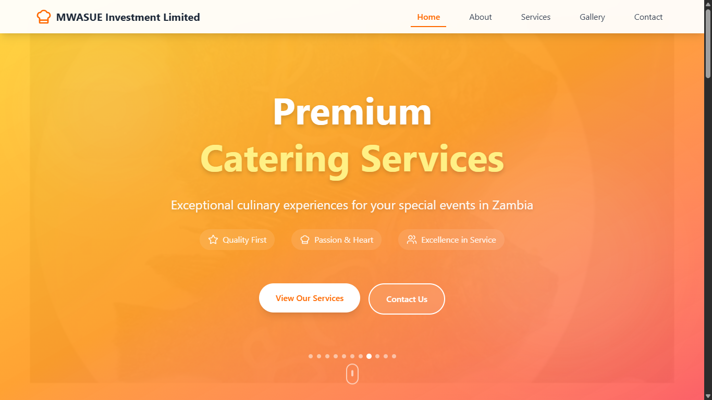
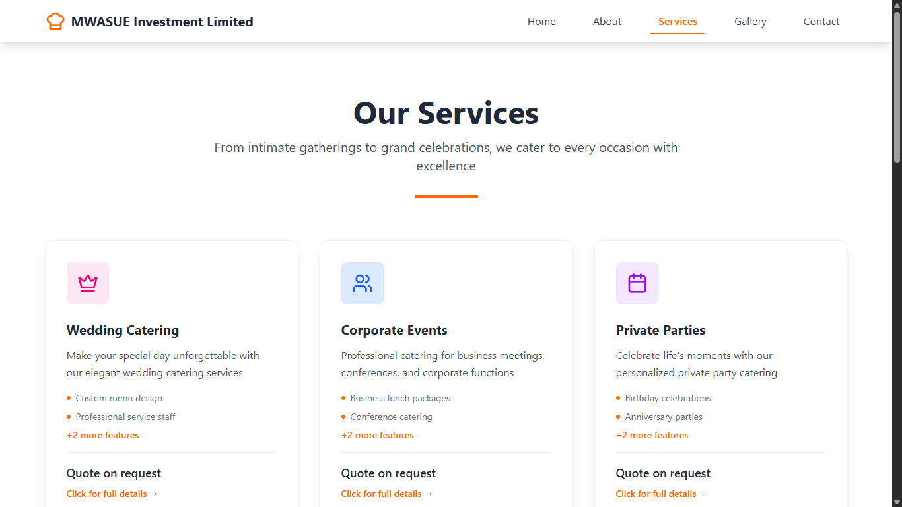
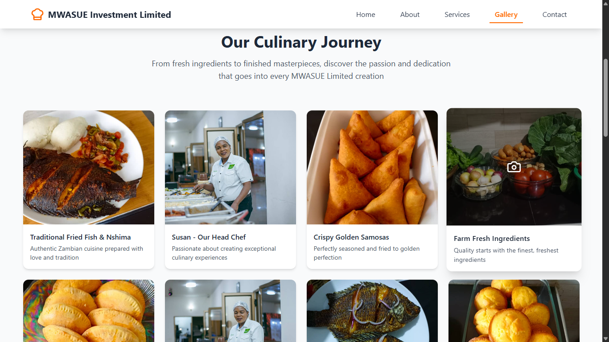
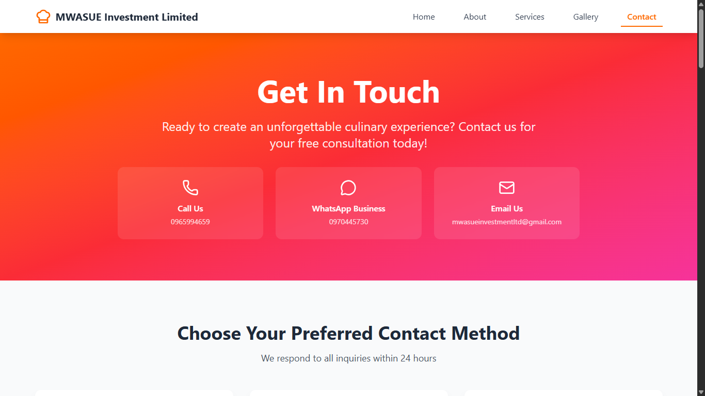

# MWASUE Investment Limited - Catering Website


A modern, responsive website for MWASUE Investment Limited, a premium catering company based in the Copperbelt region of Zambia. This website showcases our culinary expertise, services, and passion for creating exceptional dining experiences.

**Live Website:** [https://mwasue.netlify.app/](https://mwasue.netlify.app/)

## 📱 Screenshots

### Homepage

*Hero section with dynamic image slideshow and service highlights*

### Services Page

*Comprehensive service offerings with detailed modals*

### Gallery

*Visual showcase of our culinary creations and team*

### Contact Form

*Interactive contact form with EmailJS integration*

---

## 🏢 About MWASUE Investment Limited

MWASUE Investment Limited was founded in January 2025 by Susan Mwape with a vision to bring exceptional catering services to the Copperbelt region. Our company has quickly established itself as a trusted name in event catering, having successfully catered over 70 events since our inception.

### Our Team
- **Susan Mwape** - Founder & Head Chef (10+ years experience)
- **Elizabeth Mwape** - Executive Chef (8+ years experience)  
- **Chibwe Musendeka** - Catering Manager (Software Engineering background)

### Service Areas
- **Primary:** Kitwe, Kalulushi (standard rates)
- **Extended:** Ndola, Mufulira, and other Copperbelt locations (travel fees apply)

### Contact Information
- **Phone:** +260965994659
- **WhatsApp:** +260970445730
- **Email:** mwasueinvestmentltd@gmail.com

---

## ✨ Features

### 🎨 User Experience
- **Responsive Design** - Optimized for all devices (mobile, tablet, desktop)
- **Dynamic Image Slideshow** - Auto-advancing hero section with 11 high-quality images
- **Interactive Animations** - Smooth Framer Motion animations throughout
- **Modern UI/UX** - Clean, professional design with intuitive navigation

### 🛠️ Functionality
- **Contact Form Integration** - EmailJS-powered contact forms with validation
- **Service Modals** - Detailed service information in interactive popups
- **Image Gallery** - Lightbox gallery with navigation controls
- **WhatsApp Integration** - Direct WhatsApp messaging for quick inquiries
- **Mobile-First Design** - Optimized for mobile users first

### 📄 Pages
- **Home** - Hero section, core values, and services overview
- **About** - Company story, team profiles, and milestones
- **Services** - Detailed service offerings with pricing information
- **Gallery** - Visual showcase of food, team, and events
- **Contact** - Multiple contact methods and comprehensive quote form

---

## 🚀 Tech Stack

### Frontend Framework
- **React 19.1.1** - Modern React with latest features
- **Vite 7.1.2** - Fast build tool and development server

### Styling & UI
- **Tailwind CSS 4.1.12** - Utility-first CSS framework
- **Framer Motion 12.23.12** - Animation library for React
- **Lucide React 0.539.0** - Beautiful icon library

### Routing & Navigation
- **React Router DOM 7.8.1** - Client-side routing

### Form Handling
- **React Hook Form 7.62.0** - Performant form library
- **EmailJS Browser 4.4.1** - Email service integration

### Development Tools
- **ESLint** - Code linting and formatting
- **PostCSS & Autoprefixer** - CSS processing
- **Vite Plugin React** - React integration for Vite

---

## 🛠️ Installation & Setup

### Prerequisites
- Node.js (version 16 or higher)
- npm or yarn package manager

### Quick Start
```bash
# Clone the repository
git clone https://github.com/yourusername/mwasue-website.git
cd mwasue-website

# Install dependencies
npm install

# Start development server
npm run dev
```

The development server will start at `http://localhost:5173`

### Available Scripts
```bash
# Development
npm run dev          # Start development server with hot reload

# Building
npm run build        # Create production build in /dist folder
npm run preview      # Preview production build locally

# Code Quality
npm run lint         # Run ESLint for code quality checks
```

---

## ⚙️ Configuration

### EmailJS Setup
To enable contact form functionality, you'll need to configure EmailJS:

1. **Create EmailJS Account**
   - Sign up at [emailjs.com](https://www.emailjs.com/)
   - Create a new service (Gmail, Outlook, etc.)

2. **Get Service Credentials**
   - Service ID: `service_qes8pi8`
   - Template ID: `template_yi3bgwz`
   - Public Key: `gioWt-ynbLS3ZdPKb`

3. **Update Configuration**
   ```javascript
   // src/pages/Contact.jsx - Line 73-75
   const serviceId = 'your_service_id'
   const templateId = 'your_template_id'  
   const publicKey = 'your_public_key'
   ```

4. **Email Template Variables**
   Ensure your EmailJS template includes these variables:
   ```
   {{to_name}} {{from_name}} {{from_email}} {{from_phone}}
   {{event_type}} {{event_date}} {{guest_count}} {{location}}
   {{cuisine_style}} {{chaffing_dish}} {{service_staff}}
   {{setup_cleanup}} {{dietary_requirements}} {{budget_range}}
   {{additional_notes}} {{message}}
   ```

### Environment Variables (Optional)
Create a `.env` file in the root directory:
```env
VITE_EMAILJS_SERVICE_ID=your_service_id
VITE_EMAILJS_TEMPLATE_ID=your_template_id
VITE_EMAILJS_PUBLIC_KEY=your_public_key
```

---

## 📁 Project Structure

```
mwasue-website/
├── public/
│   ├── mwasue-logo.svg      # Company logo
│   └── index.html           # HTML template
├── src/
│   ├── assets/              # Images and media files
│   │   ├── Susan1.jpg       # Team photos
│   │   ├── Fried Fish & Nshima.jpg
│   │   └── [11 total food/team images]
│   ├── components/          # Reusable React components
│   │   ├── Navigation.jsx   # Site navigation
│   │   ├── Hero.jsx         # Homepage hero section
│   │   ├── CoreValues.jsx   # Company values component
│   │   ├── Services.jsx     # Services showcase
│   │   ├── Footer.jsx       # Site footer
│   │   └── ScrollToTop.jsx  # Scroll behavior management
│   ├── pages/               # Main page components
│   │   ├── Home.jsx         # Homepage
│   │   ├── About.jsx        # About us page
│   │   ├── Services.jsx     # Services page
│   │   ├── Gallery.jsx      # Image gallery
│   │   └── Contact.jsx      # Contact & quote forms
│   ├── App.jsx              # Main app component
│   ├── main.jsx             # React entry point
│   └── index.css            # Global styles (Tailwind imports)
├── package.json             # Dependencies and scripts
├── vite.config.js           # Vite configuration
├── tailwind.config.js       # Tailwind CSS configuration
├── eslint.config.js         # ESLint configuration
└── README.md               # This file
```

---

## 🚀 Deployment

### Netlify Deployment (Current)
This project is currently deployed on Netlify at: [https://incredible-stardust-28ceb2.netlify.app/](https://incredible-stardust-28ceb2.netlify.app/)

#### Deploy to Netlify
1. **Build the project**
   ```bash
   npm run build
   ```

2. **Deploy via Netlify CLI**
   ```bash
   # Install Netlify CLI
   npm install -g netlify-cli
   
   # Login to Netlify
   netlify login
   
   # Deploy
   netlify deploy --prod --dir=dist
   ```

#### Alternative Deployment Options

**Vercel**
```bash
# Install Vercel CLI
npm install -g vercel

# Deploy
vercel --prod
```

**GitHub Pages**
```bash
# Install gh-pages
npm install --save-dev gh-pages

# Add to package.json scripts
"deploy": "gh-pages -d dist"

# Deploy
npm run build && npm run deploy
```

---

## 🎨 Core Values & Services

### Our Core Values
- **Quality First** - Never compromise on ingredients or preparation
- **Passion & Heart** - Love for cooking in every event
- **Integrity & Trust** - Honest communication and reliable service
- **Innovation & Creativity** - New flavors while honoring tradition
- **Respect & Inclusivity** - Celebrating diversity and welcoming all
- **Sustainability & Community** - Supporting local suppliers

### Service Offerings
- **Wedding Catering** - Elegant catering for special days
- **Corporate Events** - Professional business event catering
- **Private Parties** - Personalized celebration catering
- **Fine Dining Experience** - Luxury dining with premium ingredients
- **Casual Catering** - Relaxed catering for informal gatherings
- **Custom Menus** - Tailored culinary experiences
- **Chaffing Dish Rental** - Equipment rental services

---

## 🤝 Contributing

We welcome contributions to improve the website! Here's how you can help:

### For Developers
1. **Fork the repository**
2. **Create a feature branch**
   ```bash
   git checkout -b feature/your-feature-name
   ```
3. **Make your changes**
4. **Test thoroughly**
5. **Submit a pull request**

### For Content Contributors
- **Photography** - High-quality food and event photos
- **Content** - Blog posts, service descriptions, testimonials
- **Translations** - Help us reach more communities

### Code Style Guidelines
- Use **Tailwind CSS** classes for styling
- Follow **React Hooks** patterns
- Maintain **responsive design** principles
- Add **Framer Motion** animations for new components
- Keep **accessibility** in mind (ARIA labels, keyboard navigation)

---

## 📝 License & Copyright

```
Copyright (c) 2025 MWASUE Investment Limited

All rights reserved. This code and associated documentation files (the "Software") 
are proprietary and confidential. No part of this Software may be reproduced, 
distributed, or transmitted in any form or by any means, including photocopying, 
recording, or other electronic or mechanical methods, without the prior written 
permission of MWASUE Investment Limited.
```

---

## 📞 Support & Contact

### For Website Issues
- **Email:** chibwemusendeka@gmail.com (Technical Support)
- **GitHub Issues:** Create an issue in this repository

### For Catering Services
- **Phone:** +260965994659 (Susan Mwape)
- **WhatsApp:** +260970445730
- **Email:** mwasueinvestmentltd@gmail.com

### Business Hours
- **Monday - Friday:** 8:00 AM - 6:00 PM
- **Saturday:** 9:00 AM - 4:00 PM
- **Sunday:** Emergency bookings only

---

## 🎯 Future Enhancements

### Planned Features
- [ ] **Online Ordering System** - Direct menu ordering capability
- [ ] **Event Calendar** - Available dates and booking calendar
- [ ] **Customer Reviews** - Testimonials and rating system
- [ ] **Blog Section** - Cooking tips and company updates
- [ ] **Multi-language Support** - Local language translations
- [ ] **Payment Integration** - Mobile Money payment processing
- [ ] **Admin Dashboard** - Content management system

### Technical Improvements
- [ ] **Progressive Web App (PWA)** - Offline functionality
- [ ] **SEO Optimization** - Enhanced search engine visibility
- [ ] **Performance Optimization** - Image optimization and lazy loading
- [ ] **Analytics Integration** - Google Analytics and tracking
- [ ] **Automated Testing** - Unit and integration tests

---

## 🏆 Achievements

- ✅ **70+ Successful Events** catered since January 2025
- ✅ **100% Client Satisfaction** rate maintained
- ✅ **Modern Web Presence** with responsive design
- ✅ **Local Partnership** with Copperbelt suppliers
- ✅ **Same-Day Response** guarantee for all inquiries

---

*Built with ❤️ in Zambia by the MWASUE Investment Limited team*

**Last Updated:** January 2025
